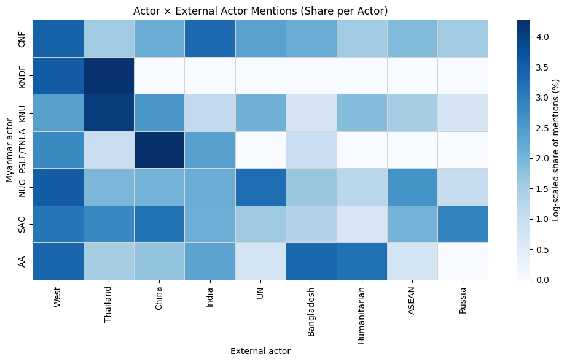
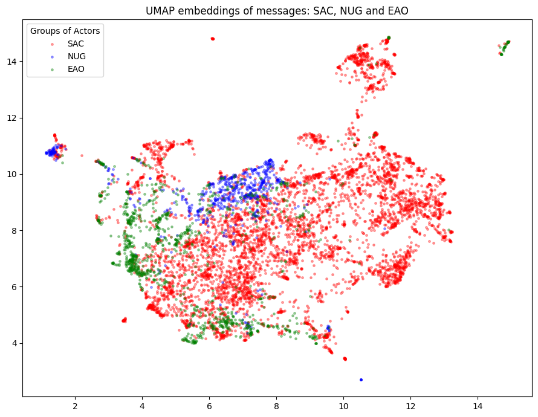

# Thesis_Myanmar

Data exploration for my Master’s thesis on **“Foreign Policy Strategies of Actors in the Myanmar Conflict.”**

The main analysis code can be found in `main.ipynb`.

---

## Data Sources

The data was collected from Telegram channels of the following actors:

- **State Administration Council** (now *State Security and Peace Commission*) — **SAC** — t.me/nationalnewschannel | t.me/hminewai |  t.me/Hno969888
- **National Unity Government** — **NUG** — t.me/nugmyanmar 
- **United Arakan League** — **UAL** — t.me/aainfodesk
- **Palaung State Liberation Front** — **PSLF** — t.me/taangtv2023
- **Karen National Union** — **KNU** — t.me/Karen_Information_Center
- **Karenni Nationalities Defence Force** — **KNDF** — t.me/KNDF_official
- **Chinland National Front** — **CNF** — t.me/Chinlandinformationcenter

The data was initially collected in **JSON format**, then converted into datasets and cleaned.

---

## External Actors Dataset

After preprocessing, a dataset (`external_mentions.csv`) was created containing posts that **only include mentions of the following external actors**:

- China  
- Russia  
- India  
- Western countries (the US, EU, the UK)  
- Bangladesh  
- Thailand  
- ASEAN  
- The UN  
- A number of humanitarian organizations  

For further analysis, the dataset (`mentions_english.csv`) was translated into English using **Google Translate**.

---

## Research question

How do different actors in the Myanmar conflict talk about external actors, over time, and in what contexts?

---

## Overview

After preprocessing and exploding multi-actor mentions, the dataset contains:

- **Total external actor mentions:** 9,540  
- **Myanmar conflict actors:** 7  
- **External actors covered:** 9  

- **Most posts from:** SAC  
- **Most frequently external actor in the dataset:** West  

Each row in the dataset represents a **single mention of an external actor** within a Telegram post.  
Posts mentioning multiple external actors are counted once per actor.

## Heatmap: who mentions whom

The heatmap shows the distribution of external actor mentions across Myanmar conflict actors.
Values represent the share of mentions normalized within each actor, with darker colors indicating greater relative attention to a given external actor.
A logarithmic scale is applied to enhance visual contrast.

## UMAP

**UMAP** was used to project sentence embeddings into a two-dimensional space in order to preserve local semantic neighborhoods. Actor labels were applied *post hoc*, allowing for an unsupervised assessment of discursive proximity between **SAC**, **NUG**, and **EAO** communications.

